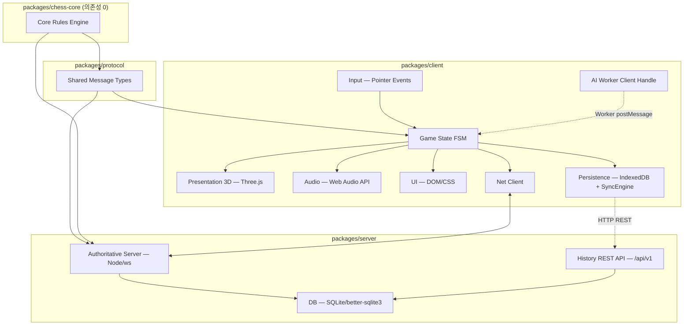

# D1. ARCHITECTURE.md

## 요약 (Executive Summary)

- **룰 엔진(`chess-core`)은 렌더러를 전혀 모른다.** 순수 TS, 의존성 0, Node/브라우저/Worker 어디서나 동일 코드로 실행되어 서버 검증과 클라이언트 예측이 같은 소스를 공유한다.
- **보드 표현은 0x88.** 비트보드 대비 클라이언트 좌표 변환·디버깅이 쉽고, 목표 AI depth(8~10)에는 충분하다(D2).
- **애니메이션·전투 연출은 전부 데이터 주도(`AnimationRegistry`)다.** 36개 전투 연출 추가 시 엔진 코드는 한 줄도 바뀌지 않는다(D5, R12).
- **`UnitProvider` 어댑터로 절차적 생성 ↔ GLTF를 콜사이트 변경 없이 교체 가능**하게 설계했다(D4).
- **전투 연출은 게임 시계를 소비하지 않는다.** 서버는 `MOVE` 수신 즉시 시계를 확정하고, 연출은 그 이후 순수 클라이언트 시각 효과로만 재생된다(D5-4, D6).
- **AI는 반드시 Web Worker에서 실행**되어 메인 스레드를 절대 블록하지 않는다(D3).
- **서버는 권위 모델(authoritative).** 클라이언트는 낙관적 로컬 예측만 하고, 모든 수는 서버의 `chess-core`로 재검증된다(D6).
- **모바일은 처음부터 품질 티어 시스템(Auto/Low/Medium/High/Ultra)으로 설계**되어 있다(D9) — 후순위 대응이 아니다.
- **렌더 온디맨드**: 체스는 정적 구간이 길다는 특성을 살려 애니메이션/입력이 없으면 렌더 루프를 스로틀한다(D9).
- **12개 스프린트로 분할**, 각 스프린트 종료 시점마다 게임이 항상 실행 가능한 상태를 유지한다(never-broken-build, D9).
- **전체 아트/오디오 톤은 중세(Medieval) 판타지로 고정**되며(R14), 이는 스타일 지침이 아니라 **최상위 제약**이다 — 유닛 모티프·재질·발광·환경·UI 장식 전부가 중세 어휘 안에 있어야 하고(D4 §0의 허용/금지 표), BGM은 **중세 악기 팔레트 5종(류트/하프/내추럴호른/프레임드럼·타보르/비올)만**으로 절차 합성한다(D8 §BGM). 3테마는 악기를 바꾸지 않고 조성·템포·편성 밀도만 바꾼다.
- **모든 매치 결과는 영속화된다(R15).** 로컬 2인/CPU/온라인 공통으로 **오프라인 우선** 구조 — 결과는 항상 클라이언트 IndexedDB에 먼저 쓰이고, 온라인일 때 서버 DB(SQLite)로 동기화된다. 플레이어 식별은 가입 없는 **닉네임 + 클라이언트 발급 UUID**(`localStorage`)이며, 온라인 매치 기록은 **서버가 권위적으로** 작성해 클라이언트가 결과를 위조할 수 없다. 전적 조회는 WS가 아닌 별도 HTTP REST 엔드포인트로 제공한다(D10).

---

## 시스템 아키텍처



**Persistence 관심사(R15, D10):** 클라이언트는 `packages/client/src/persistence/`(IndexedDB `bcr-history`, `MatchRecorder`/`SyncEngine`/`HistoryClient`), 서버는 `packages/server/src/db/`(SQLite 파일 `packages/server/data/bcr.sqlite`, `MatchRepository`/`HistoryQueries`/`PlayerRepository`)에 격리된다. **SQL 문자열은 `server/src/db/` 밖에 존재하지 않으며**, `match.ts`/REST 핸들러는 리포지토리 인터페이스만 호출한다(DB 교체 시 영향 범위를 한 디렉토리로 한정). 게임플레이는 WS, 전적 조회·동기화는 같은 `node:http` 서버에 얹은 REST 라우트를 쓴다(새 프로세스/포트 없음).

**핵심 원칙:** `chess-core`는 최하위 레이어이며 아무것도 import하지 않는다. `protocol`은 `chess-core`의 타입만 참조한다. `client`/`server`는 둘 다 `chess-core`+`protocol`을 사용하지만 서로를 import하지 않는다(네트워크 메시지로만 통신). 이 방향성이 깨지면 서버 재사용이 불가능해지므로(§핸드옵 가이드 §2-2) CI에서 정적 검사로 강제한다(`grep -rL "from 'three'" packages/chess-core/src` 가 전체 파일과 일치해야 함, 즉 chess-core 어디에도 `three` import가 없어야 함).

## 디렉토리 구조 (전체)

```
battle-chess-reforged/
  package.json                    # npm workspaces 루트
  tsconfig.base.json
  vite.config.ts
  packages/
    chess-core/
      package.json
      tsconfig.json
      src/
        types.ts        # Color, PieceType, Square, Move, MoveFlag(비트필드), Position, GameResult
        board.ts         # 0x88 보드 유틸(파일/랭크 추출, 오프보드 판정)
        movegen.ts        # generateLegalMoves + pseudo-legal 생성기
        makemove.ts        # makeMove (불변)
        zobrist.ts         # zobristHash, 증분 갱신 헬퍼
        fen.ts              # toFEN/fromFEN
        san.ts               # toSAN
        result.ts             # getGameResult, isInsufficientMaterial
        perft.ts                # perft(pos, depth)
        index.ts                 # 배럴 export
      __tests__/
        perft.test.ts
        movegen.test.ts
    protocol/
      src/
        messages.ts        # Envelope<T,P> + 20종 discriminated union (D6 §D6-2)
        history.ts         # R15/D10 히스토리 REST DTO (MatchSummaryDto 등)
        index.ts
    client/
      index.html
      src/
        main.ts
        engine/
          Renderer.ts
          Scene.ts
          Camera.ts
          QualityTier.ts
          RenderScheduler.ts   # 렌더 온디맨드
          DeviceDetect.ts
          GeometryCache.ts
          MaterialCache.ts
          themes/                # BoardTheme 3종 (D4 §8.3)
            castleHall.ts, frozenKeep.ts, volcanicRuin.ts, index.ts
        units/
          UnitProvider.ts        # 인터페이스
          ProceduralUnitFactory.ts
          builders/
            PawnBuilder.ts, KnightBuilder.ts, BishopBuilder.ts,
            RookBuilder.ts, QueenBuilder.ts, KingBuilder.ts
          GLTFUnitProvider.ts     # 스텁(어댑터 자리, 초기엔 미구현 — D4 §7)
        anim/
          dsl.ts                  # clip(), track()
          AnimClipCompiler.ts
          AnimationRegistry.ts
          AnimationController.ts   # 상태 FSM, 크로스페이드
          CombatDirector.ts         # 전투 연출 재생/스킵/큐잉
          CameraRig.ts
          data/
            movementClips/*.ts
            combatScenes/*.ts        # 36개 파일, 1 export/file
            index.ts                  # 배럴, register() 자동 수집
        audio/
          AudioGraph.ts
          SoundRegistry.ts
          synth/  (footstep.ts, impact.ts, shimmer.ts, stinger.ts, ...)
        ui/
          hud/, menus/, settings/
        net/
          NetClient.ts
          PredictionBuffer.ts
          ReconnectController.ts
        persistence/           # R15/D10 — 오프라인 우선 전적 저장
          schema.ts              # LocalMatchRecord, LocalGameRecord, SyncOp 등
          identity.ts            # PlayerIdentity, localStorage['bcr:identity']
          IndexedDbStore.ts      # PersistenceStore 구현 (DB 'bcr-history' v1)
          MatchRecorder.ts       # game:matchEnded 구독 → 로컬 기록
          SyncEngine.ts          # 백오프 재시도 업로드
          HistoryClient.ts       # /api/v1 REST 호출부
        ai/
          AiWorkerHandle.ts
          worker/ai.worker.ts       # chess-core + search 포함
        input/
          PointerController.ts
          Raycaster.ts
        game/
          GameSession.ts             # 최상위 FSM
          EventBus.ts
    server/
      data/
        bcr.sqlite                # 런타임 생성, .gitignore 대상
      src/
        netServer.ts
        room.ts
        match.ts
        clock.ts
        session.ts
        http/
          historyApi.ts            # /api/v1 라우트 (ws와 동일 node:http 서버에 attach)
        db/                        # R15/D10 — SQL은 이 디렉토리 밖에 존재 금지
          connection.ts            # better-sqlite3 + PRAGMA(WAL/NORMAL/foreign_keys)
          migrations/001_init.sql
          PlayerRepository.ts
          MatchRepository.ts
          HistoryQueries.ts
  docs/
    AGENT_RULES.md
    design/ (본 문서들 — D1~D10)
    PROGRESS.md
    DEVIATIONS.md
    OPEN_QUESTIONS.md
```

## 의존 방향 규칙

| From \ To | chess-core | protocol | client | server | three | 외부 DB 드라이버 |
|---|---|---|---|---|---|---|
| chess-core | — | ❌ | ❌ | ❌ | ❌ | ❌ |
| protocol | ✅ | — | ❌ | ❌ | ❌ | ❌ |
| client | ✅ | ✅ | — | ❌ | ✅ | ❌ (브라우저 IndexedDB만) |
| server | ✅ | ✅ | ❌ | — | ❌ | ✅ (`better-sqlite3`, `server/src/db/` 안에서만) |

**Persistence 레이어 의존 규칙 (R15/D10, CI 정적 검사 대상):**

| 모듈 | 허용 의존 | 금지 |
|---|---|---|
| `client/src/persistence/**` | `protocol`(DTO), `chess-core` 타입, `game/EventBus` | `three` import 금지(렌더러 무지 유지), `net/NetClient` 직접 import 금지 — 연결 상태는 `net:connected` 이벤트로만 인지 |
| `server/src/db/**` | `better-sqlite3`, `chess-core`, `protocol` | `ws` import 금지(전송 계층 무지), `three` 금지 |
| `server/src/http/historyApi.ts` | `server/src/db/*` 리포지토리 인터페이스, `protocol` | 원시 SQL 문자열 금지(전부 `db/`에 위치) |
| `server/src/match.ts` | `MatchRepository` 인터페이스 | 원시 SQL 금지 |

CI 검사: `grep -rn "SELECT \|INSERT \|CREATE TABLE" packages/server/src --include=*.ts` 결과가 `packages/server/src/db/` 경로에만 매치해야 한다. `grep -rn "from 'three'" packages/client/src/persistence` 는 0건이어야 한다.

## 이벤트 버스 (전체 취합)

네이밍: `domain:eventName`. `GameSession`의 `EventBus`(모듈 스코프 싱글턴, `mitt` 유사 자체 구현 — 외부 의존성 추가 금지)를 통해 레이어 간 통신한다. 렌더러는 절대 `chess-core`의 `Position`을 직접 mutate하지 않는다.

| 이벤트 | 페이로드 | 발행 | 구독 |
|---|---|---|---|
| `game:moveRequested` | `{ move: Move }` | Input | GameSession |
| `game:moveApplied` | `{ move: Move; position: Position; result: GameResult }` | GameSession | PRES, UI, AUDIO, NET |
| `game:moveRejected` | `{ move: Move; reason: string }` | NET(서버 거부 전달) | GameSession, UI |
| `game:turnChanged` | `{ turn: Color }` | GameSession | UI |
| `game:resultDetermined` | `{ result: GameResult }` | GameSession | UI, NET |
| `anim:movementStart` | `{ unitId: string; move: Move; clipId: string }` | AnimationController | AUDIO, RenderScheduler(dirty) |
| `anim:movementEnd` | `{ unitId: string }` | AnimationController | GameSession(다음 입력 unblock) |
| `anim:combatSceneStart` | `{ sceneId: string; attacker: PieceType; defender: PieceType }` | CombatDirector | AUDIO, CameraRig, UI(스킵힌트) |
| `anim:combatSceneSkipped` | `{ sceneId: string; atSec: number }` | Input(탭/ESC) | CombatDirector |
| `anim:combatSceneEnd` | `{ sceneId: string }` | CombatDirector | GameSession, RenderScheduler |
| `ai:searchStart` | `{ difficulty: Difficulty }` | GameSession | UI(사고중 인디케이터) |
| `ai:searchResult` | `{ move: Move; evalScoreCp: number }` | AiWorkerHandle | GameSession |
| `net:connected` / `net:disconnected` | `{}` / `{ code: number }` | NetClient | UI |
| `net:moveAccepted` | `{ move: Move; clock: ClockState }` | NetClient | GameSession |
| `net:opponentReconnecting` | `{ graceRemainingMs: number }` | NetClient | UI |
| `net:matchEnd` | `{ score: MatchScore; winner: Color }` | NetClient | UI, GameSession |
| `ui:settingsChanged` | `{ key: string; value: unknown }` | UI | engine(QualityTier), anim(pacing), audio(volume) |
| `render:dirty` | `{}` | 임의(입력/애니메이션/카메라) | RenderScheduler |
| `game:matchEnded` | `{ localMatchId: string; source: MatchSource; format: MatchFormat; scoreMine: number; scoreOpponent: number; outcome: MatchOutcome; games: LocalGameRecord[] }` | MatchController | UI, **MatchRecorder(D10)** |
| `persist:matchSaved` | `{ localMatchId: string; syncState: SyncState }` | MatchRecorder | UI(전적 화면 즉시 갱신, "저장됨" 토스트) |
| `persist:matchSynced` | `{ localMatchId: string; serverMatchId: string }` | SyncEngine | UI(동기화 배지 갱신) |
| `persist:syncFailed` | `{ localMatchId: string; attempts: number; reason: string }` | SyncEngine | UI(설정 화면 "미동기 N건" 표시) |
| `persist:saveFailed` | `{ localMatchId: string; reason: 'quota' \| 'blocked' \| 'unknown' }` | MatchRecorder | UI(토스트) — **게임 플로우는 절대 중단하지 않는다** |
| `persist:historyLoaded` | `{ source: 'local' \| 'server'; matches: MatchSummaryDto[]; totalCount: number }` | HistoryClient / IndexedDbStore | UI(전적 화면 렌더) |
| `persist:identityReady` | `{ playerId: string; nickname: string; serverRegistered: boolean }` | identity.ts | UI, NetClient(`PLAYER_IDENTIFY` 발신 트리거) |

## 설계 문서 인덱스 (D1~D10)

| # | 파일 | 내용 | 비고 |
|---|---|---|---|
| D1 | `ARCHITECTURE.md` | 레이어·의존 방향·디렉토리·이벤트 버스·전체 Open Decisions 취합 | 본 문서 |
| D2 | `RULES_ENGINE.md` | 0x88 보드, 공개 API, Zobrist, **perft 검증표** | |
| D3 | `AI_DESIGN.md` | 난이도 4단계, PST 수치, 탐색 의사코드, Web Worker 프로토콜 | |
| D4 | `UNITS_AND_ASSETS.md` | **§0 중세 톤 고정(R14)**, 유닛 12종 실루엣/본/머티리얼/LOD, `UnitProvider` | |
| D5 | `ANIMATION_SYSTEM.md` | 클립 DSL, `AnimationRegistry`, **전투 연출 36조합 전수**, 페이싱, 카메라 | ⭐ 최대 분량 |
| D6 | `NETWORK_DESIGN.md` | 권위 모델, **메시지 20종**, 매치 FSM, 시계, 재접속, 안티치트 | |
| D7 | `UX_UI_SPEC.md` | 화면 흐름, HUD 좌표, 조작, 접근성, 반응형, 설정 항목 | |
| D8 | `AUDIO_DESIGN.md` | 오디오 그래프, SFX 큐 시트, **BGM 중세 팔레트(R14)**, 합성 레시피 | |
| D9 | `PERFORMANCE_AND_ROADMAP.md` | 성능 예산표, 최적화 전략, **12 스프린트 + DoD**, 리스크 | |
| D10 | `PERSISTENCE_DESIGN.md` | **(R15)** 플레이어 아이덴티티, IndexedDB 스키마, 서버 SQLite 스키마, 히스토리 REST API, 동기화/개인정보 | 신규 |
| — | `_CONTRACTS.md` | 문서 간 공유 타입·경로·메시지 이름의 **단일 정본** | 충돌 시 이 파일이 우선 |

## Sonnet 인수인계 체크리스트

1. `docs/design/` **10개 문서(D1~D10, D5는 D5-3 36조합 포함 단일 파일)** 를 전부 읽었는가.
2. `_CONTRACTS.md`의 핵심 타입(Move, Position, UnitProvider, AnimationRegistry, Envelope, PlayerIdentity, LocalMatchRecord)을 그대로 사용하는가 — 임의 변경 금지.
3. Sprint 1(D9-2)부터 순서대로, 스프린트당 세션 1개로 진행하는가.
4. `chess-core`에 `three` import가 없는지 CI로 강제하는가.
5. perft 표(D2)와 실제 노드 수가 정확히 일치할 때까지 룰 엔진을 완료로 선언하지 않는가.
6. 전투 연출은 `combatScenes/*.ts` 데이터 파일 추가만으로 등록되고, 엔진 코드(`CombatDirector.ts` 등)는 변경되지 않는가.
7. AI는 Web Worker에서만 실행되는가.
8. (R15) 매치 결과가 **항상 IndexedDB에 먼저** 기록되고, 온라인 매치 레코드는 **서버가 `MATCH_END` 전송 전에** 커밋하는가(D10 §D10-5).
9. (R15) SQL이 `packages/server/src/db/` 밖에 새어나가지 않는가(위 CI 검사).
10. (R14) 새로 추가하는 아트/오디오 자산이 D4 §0의 허용 목록과 D8 §BGM 악기 5종 안에 있는가.

## ⚠️ 사용자 확인 필요 항목 (전체 취합, Open Decisions)

| 출처 | 항목 | 옵션 A | 옵션 B | 추천 |
|---|---|---|---|---|
| D3 | 오프닝북 데이터 포맷 | 경량 자체 JSON(50~200KB) | Polyglot .bin | **A** |
| D4 | InstancedMesh vs SkinnedMesh 캐시 공유(폰 등) | SkinnedMesh+캐시 공유 | 본 텍스처 베이킹 InstancedMesh | **A** |
| D4 | LOD2 임포스터 생성 시점 | 빌드 타임 사전 생성 | 런타임 첫 진입 시 생성 | **A** |
| D4 | Golem(Rook) 부유 블록 개수 | 3개 | 4개 | **A**(파라미터화, 추후 조정 가능) |
| D5 | 망토/로브 시뮬레이션 방식 | 본 체인 진자 근사 | 버텍스 셰이더 클로스 | **A** |
| D5 | Short 모드 구현 방식 | 배속 재생 | 비트 재편집 별도 클립 | **A** |
| D5 | 발 IK | 절차적 페이크 | 실시간 2-bone IK | **A** |
| D6 | 매치메이킹 레이팅(Elo/Glicko) 도입 | 미도입(v1) | Glicko-2 도입 | **A** |
| D6 | Bo3 1.5:1.5 동점 처리 | 매치 무승부 종료 | Armageddon 5국 | **A** |
| ~~D6~~ | ~~방 생성 메시지 설계~~ | — | — | **결정 완료** — `ROOM_CREATED` 신설 확정(D6 §D6-9) |
| **D10** | 정식 계정 / 기기 이전(device migration) | 익명 UUID 유지 + **백업 코드 UI를 v1에 포함** | 이메일/OAuth 계정 연동 | **A** — R15가 명시적으로 열어둔 항목. *v1에 백업 코드 UI를 넣을지 여부에 대한 사용자 답변 필요* |
| **D10** | 오프라인(로컬2P/CPU) 결과 취급 등급 | 저장·표시하되 `verified=0` 배지 + 통계 분리 집계 | 로컬 전용(서버 미업로드) | **A** |
| **D10** | 서버 전적 보존 기간 | 24개월 후 자동 삭제 | 무기한 보존 | **A** |
| D7 | Bo3 인터미션 자동 진행 시간 | 8s(로컬)/15s(온라인) 고정 | 무제한(양측 Ready 대기) | **A** |
| D7 | 온라인 무르기(Takeback) 허용 여부 | 로컬/CPU만 허용, 온라인 금지 | 온라인도 상대 동의 시 허용 | **A** |
| D9 | 그림자 전략 | 베이크 콘택트섀도우 + 연출 중 임시 스팟 그림자 | 상시 실시간 그림자 | **A** |
| D9 | 초기 로드 상한 | 900KB gzip | 500KB gzip(더 엄격) | **A**(Sprint 11 실측 후 재검토) |

**전부 옵션 A(현 설계 유지)가 추천안입니다.** 다른 방향을 원하시면 해당 항목만 알려주시면 관련 문서를 갱신하겠습니다. 별도 이견이 없으면 이 추천안대로 Sprint 1을 시작합니다.
