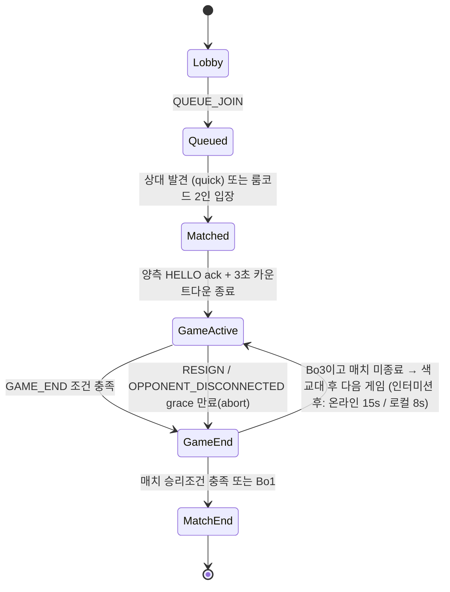

# D6. NETWORK_DESIGN.md

## 개요

이 문서는 `packages/server`(Node.js + `ws`) 와 `packages/client/src/net` 간의 권위 서버(authoritative server) 네트워크 설계를 정의한다. 서버는 `packages/chess-core`를 그대로 재사용하여 모든 수를 재검증한다. `packages/protocol`은 클라이언트-서버 간 공유 메시지 타입을 정의하며 `chess-core` 타입만 참조할 수 있다(3장 의존 방향 계약 준수).

---

## D6-1. 권위 모델 (Authoritative Model)

**원칙:** 서버가 유일한 진실(source of truth)이다. 클라이언트는 사용자 입력 즉시 로컬에서 수를 적용(optimistic local apply)하여 체감 지연을 0으로 만들지만, 서버의 `MOVE_ACCEPTED`/`MOVE_REJECTED` 응답이 최종 판정이다.

### 흐름
1. 사용자가 기물을 이동 → 클라이언트가 `chess-core.generateLegalMoves()`로 로컬에서 즉시 합법성 확인 후 **낙관적으로 적용**(보드 애니메이션 시작, 기보 갱신).
2. 동시에 `MOVE` 메시지를 서버에 전송, `pendingMoves` 큐에 push (클라이언트 상태에 `status: 'pending'` 태그).
3. 서버는 `chess-core.makeMove()`로 재검증.
   - 성공 → `MOVE_ACCEPTED` 브로드캐스트 (양쪽 클라이언트에), 클라이언트는 `pending` 태그 제거.
   - 실패 → `MOVE_REJECTED`를 해당 클라이언트에만 전송.

### 롤백 UX (정확한 사양)
- `MOVE_REJECTED` 수신 시 클라이언트는 **200ms 이내에** 즉시 보드를 `MOVE_REJECTED.payload.authoritativePosition`(FEN)으로 스냅백한다. 애니메이션 없이 즉시 스냅(트윈 시 오히려 혼란 유발) — 단, 스냅 직후 0.15초간 보드 테두리에 빨간색 플래시(오버레이, opacity 0→0.4→0 ease-out)를 준다.
- 화면 하단에 토스트 알림 "서버와 동기화되지 않았습니다 — 되돌립니다" (2초간 표시, 자동 소멸). `payload.reason`이 `'stale'`(네트워크 지연으로 이미 다른 수가 처리됨)인 경우 문구를 "상대가 먼저 두었습니다"로 분기.
- 이 조건이 발생하면 클라이언트는 자동으로 `STATE_SYNC`를 1회 요청하여 완전한 상태 일치를 보장한다(부분 롤백으로 인한 잔여 애니메이션 상태 오염 방지).
- 실무 발생 빈도: 정상 네트워크(RTT < 150ms)에서는 거의 발생하지 않음 — 클라이언트가 이미 로컬 `chess-core`로 완전한 룰 검증을 하므로 REJECTED는 주로 **경쟁 상태**(상대가 먼저 서버에 도달)에서만 발생. 자신의 턴이 아닌데 보낸 MOVE는 애초에 UI에서 차단되므로 이 경로를 타지 않는다.

**⚠️ DECISION NEEDED 없음** — 이 부분은 표준 낙관적 동기화 패턴으로 트레이드오프가 낮아 결정 불필요.

---

## D6-2. 메시지 프로토콜

### 봉투(Envelope) 패턴
```ts
// packages/protocol/src/messages.ts
interface Envelope<T extends string, P> {
  type: T;
  seq: number;      // 발신자 기준 단조증가 시퀀스 번호 (재전송/중복 감지용)
  ts: number;        // 발신 시각 epoch ms (클록 동기화 및 레이턴시 측정용)
  payload: P;
}
```
`type ClientMessage = Envelope<'HELLO', HelloPayload> | Envelope<'QUEUE_JOIN', QueueJoinPayload> | ... ;`
`type ServerMessage = Envelope<'MATCH_FOUND', MatchFoundPayload> | ... ;`
전체는 `type AnyMessage = ClientMessage | ServerMessage;` 로 판별 유니온(discriminated union) 완성.

### 메시지 전체 목록

| 타입 | 방향 | 필드 (payload) |
|---|---|---|
| `HELLO` | C→S | `{ clientVersion: string; sessionToken?: string }` — `sessionToken` 있으면 재접속 시도로 처리 |
| `PLAYER_IDENTIFY` | C→S | `{ playerId: string; nickname: string; secret?: string }` — R15/D10. `playerId`는 클라이언트가 발급한 UUID v4, `nickname`은 2~16 코드포인트. `secret`(base64url 43자)은 **서버 미등록 상태에서 최초 1회만** 전송하며 서버는 `SHA-256(secret)`만 저장한다. 서버는 `players` 레코드를 UPSERT하고 이 WS 세션에 `playerId`를 바인딩한다. `HELLO` 직후 1회 전송이 원칙이며, 닉네임 변경 시 재전송 가능 |
| `PLAYER_IDENTIFIED` | S→C | `{ playerId: string; nickname: string; isNew: boolean; secretAccepted: boolean; serverTimeMs: number }` — R15/D10. `isNew=true`면 서버에 처음 등록됨. `secretAccepted=false`면(평문 `ws://` 등) 클라이언트는 히스토리 REST API를 비활성화하고 로컬 기록만 유지한다 |
| `INTERMISSION_READY` | C↔S | `{ matchId: string; gameIndex: number }` — Bo3 판간 인터미션에서 "다음 판 준비 완료". 양측 수신 시 서버가 즉시 다음 판을 시작하고, 미수신 시 15초 후 자동 Ready 처리(D6-4, D7 §1) |
| `ROOM_CREATED` | S→C | `{ roomCode: string; expiresAtMs: number; timeControl: TimeControlPreset; matchFormat: 'bo1' \| 'bo3' }` — `QUEUE_JOIN { mode: 'roomCode' }`(코드 미지정)에 대한 방 생성 ack. 대기 화면에 코드를 즉시 표시하기 위한 경량 응답으로, `MATCH_FOUND`와 목적이 다르므로 별도 타입으로 확정(§D6-9) |
| `QUEUE_JOIN` | C→S | `{ mode: 'quick' \| 'roomCode'; roomCode?: string; timeControl: TimeControlPreset; matchFormat: 'bo1' \| 'bo3' }` |
| `MATCH_FOUND` | S→C | `{ matchId: string; opponentName: string; yourColor: Color; timeControl: TimeControlPreset; matchFormat: 'bo1' \| 'bo3'; gameIndex: number }` |
| `MOVE` | C→S | `{ matchId: string; gameIndex: number; move: Move; clientMoveId: string }` — `clientMoveId`는 UUID, ACK/REJECT 매칭용 |
| `MOVE_ACCEPTED` | S→C | `{ matchId: string; gameIndex: number; move: Move; clientMoveId: string; resultingFen: string; whiteClockMs: number; blackClockMs: number; serverAppliedTs: number }` |
| `MOVE_REJECTED` | S→C | `{ matchId: string; clientMoveId: string; reason: 'illegal' \| 'stale' \| 'notYourTurn' \| 'gameOver'; authoritativePosition: string }` |
| `STATE_SYNC` | S→C | `{ matchId: string; gameIndex: number; fen: string; moveHistory: Move[]; whiteClockMs: number; blackClockMs: number; status: GameStatus }` — 재접속/REJECTED 후 강제 동기화 |
| `CLOCK_SYNC` | S→C | `{ matchId: string; whiteClockMs: number; blackClockMs: number; serverTs: number }` — 3초 간격 하트비트 |
| `DRAW_OFFER` | C↔S | `{ matchId: string; action: 'offer' \| 'accept' \| 'decline' }` (C→S 발신, S→C 상대에게 중계) |
| `RESIGN` | C→S | `{ matchId: string; gameIndex: number }` |
| `GAME_END` | S→C | `{ matchId: string; gameIndex: number; result: 'white' \| 'black' \| 'draw'; reason: 'checkmate' \| 'stalemate' \| 'resign' \| 'timeout' \| 'draw50' \| 'repetition' \| 'insufficientMaterial' \| 'agreement' \| 'abandon'; scoreWhite: number; scoreBlack: number }` |
| `MATCH_END` | S→C | `{ matchId: string; winnerColorForYou: 'you' \| 'opponent' \| 'draw'; finalScoreYou: number; finalScoreOpponent: number; serverMatchId: string \| null }` — `serverMatchId`(R15/D10 추가)는 서버가 이 매치를 DB에 커밋한 뒤 발급한 레코드 id다. 서버는 **DB 커밋이 끝난 후에만** 이 메시지를 보낸다(write-then-notify, D10 §D10-5). 클라이언트는 값이 있으면 로컬 IndexedDB 기록을 `syncState:'synced'`로 표시하고 업로드하지 않으며, `null`(DB 쓰기 실패)이면 일반 동기화 큐에 넣어 재시도한다 |
| `OPPONENT_DISCONNECTED` | S→C | `{ matchId: string; graceSeconds: number }` |
| `RECONNECT` | C→S | `{ sessionToken: string; matchId: string }` |
| `CHAT` | C↔S | `{ matchId: string; text: string }` (서버는 40자 초과 시 절단, 욕설 필터는 v1 범위 외) |
| `EMOTE` | C↔S | `{ matchId: string; emoteId: 'gg' \| 'nice' \| 'oops' \| 'think' }` — 사전 정의 4종 한정(자유 텍스트 아님, 스팸/어뷰징 방지) |

**총 20종**(01 프롬프트 지정 16종 + `ROOM_CREATED` + `INTERMISSION_READY` + `PLAYER_IDENTIFY` + `PLAYER_IDENTIFIED`). `packages/protocol/src/messages.ts`의 판별 유니온은 정확히 이 20종으로 구성되며, `_CONTRACTS.md` §네트워크 프로토콜 봉투의 목록과 1:1로 일치해야 한다(불일치 시 `_CONTRACTS.md`가 정본).

**보조 타입 정의(위 표에서 참조하는 것 전부):**
```ts
type GameStatus = 'countdown' | 'active' | 'gameEnded' | 'intermission' | 'matchEnded';
interface MatchScore { you: number; opponent: number; }  // 0/0.5/1/1.5/2, 플레이어 기준(색 기준 아님)
```

### 히스토리 조회는 이 프로토콜에 포함되지 않는다 (R15)

R15의 전적 조회(매치 히스토리·통계)는 **WS 메시지가 아니라 별도 HTTP REST 엔드포인트**(`/api/v1/...`)로 제공한다. 근거 전문과 엔드포인트 명세는 **D10 §D10-6**에 있으며 요약하면: 히스토리는 on-demand pull이고 페이로드가 크며 **대국 중이 아닐 때(=WS 세션이 없을 때)** 주로 조회되므로, 요청-응답 상관 id·타임아웃·재시도·캐시를 프로토콜 위에 재구현할 이유가 없다. REST 라우트는 `ws`가 이미 attach된 동일 `node:http` 서버에 얹으므로 **새 프로세스/포트가 생기지 않는다**. 따라서 `MATCH_HISTORY_REQUEST`/`MATCH_HISTORY_RESPONSE` 같은 WS 메시지는 **신설하지 않는다**.

---

## D6-3. 룸/매치 생명주기 FSM



전이 트리거 요약:
- `Lobby → Queued`: 클라이언트 `QUEUE_JOIN` 수신.
- `Queued → Matched`: quick 모드는 대기열에서 두 세션 pop, roomCode 모드는 동일 코드로 2번째 참가자 입장 시.
- `Matched → GameActive`: 서버가 `MATCH_FOUND`를 양측에 전송 후 3초 카운트다운(클라이언트 로컬 표시)이 끝나면 서버가 시계 시작.
- `GameActive → GameEnd`: `chess-core.getGameResult()`가 종국 판정을 반환하거나 RESIGN/timeout 수신.
- `GameEnd → GameActive`(Bo3 continue): 매치 승리 조건 미충족 시 인터미션 화면(온라인 최대 **15초**, D7 §1과 동일 수치) 후 색을 교대하고 새 `gameIndex`로 시계 리셋. 양측 `INTERMISSION_READY`가 먼저 도착하면 즉시 진행.
- `GameEnd → MatchEnd`: Bo1이거나 Bo3에서 한쪽이 매치 스코어 조건 충족.

---

## D6-4. Bo3 매치 상태 관리

- **색 교대:** 게임 1은 서버가 무작위 배정. 게임 2는 반대 색. 게임 3(필요 시)은 다시 게임 1과 반대(즉 게임 2와 동일 배정이 아니라, **매치 시작 시 결정된 순서를 그대로 유지** — 표준 스위스/매치 관례상 백/흑이 1국마다 교대되므로 게임3은 게임1과 같은 배정). 서버는 `matchState.colorAssignment: [Color, Color, Color]` 배열로 사전 확정하여 결정론적으로 관리(재접속 시 재계산 불필요).
- **점수:** 승 1점, 무승부 0.5점, 패 0점. `scoreWhite`/`scoreBlack`는 색 기준이 아니라 **플레이어 기준**으로 서버가 별도 `matchScore: Record<playerId, number>`로 누적.
- **매치 승리 조건(Bo3):** 먼저 2.0점 도달한 플레이어가 승리. 1.5:1.5 이후 게임3까지 갔는데 무승부면 **Armageddon 없이 매치 자체를 무승부로 종료**(v1 범위 — Armageddon은 스코프 아웃, `docs/OPEN_QUESTIONS.md`에 후순위 기록 권장).
- **인터미션 화면:** 게임 종료 후 표시. 지속 시간은 **D7 §1이 정본**이며 D6는 그 값을 그대로 사용한다 — 로컬/CPU 대전 **8초**, 온라인 **15초**(서버 타이머). 온라인은 양측 `INTERMISSION_READY` 수신 시 즉시 진행하고, 15초 경과 시 서버가 미응답측을 자동 Ready 처리한다. 내용: 이번 게임 결과, 누적 매치 스코어, 다음 게임 색 배정, "다음 게임 시작까지 N초" 카운트다운(정수 초, 15→1). (기존 초안의 2.5초 표기는 D7과 충돌하므로 폐기.)

---

## D6-5. 시계(Clock) 설계

- **권위:** 서버가 유일한 시계 소유자. 클라이언트는 `CLOCK_SYNC`(3초 간격) + `MOVE_ACCEPTED.whiteClockMs/blackClockMs`를 받아 로컬에서 `requestAnimationFrame` 보간 표시만 한다 — 클라이언트 자체 카운트다운은 절대 권위를 갖지 않는다.
- **프리셋 (`TimeControlPreset`):**
  ```ts
  type TimeControlPreset =
    | { kind: 'blitz'; baseMs: 5 * 60_000; incrementMs: 3_000 }   // 5+3
    | { kind: 'rapid'; baseMs: 10 * 60_000; incrementMs: 0 }       // 10+0
    | { kind: 'unlimited' };
  ```
  기본값은 `unlimited`(핸드오프 가이드 §2-3: 캐주얼 지향이면 무제한 기본). 증가 계산: 수를 둔 직후 서버가 `clock[color] += incrementMs` 적용 후 상대 시계 감소를 시작.
- **레이턴시 보상:** 서버는 `MOVE` 수신 시각(`serverRecvTs`)에서 클라이언트가 보낸 `ts`(발신 시각)를 빼 RTT/2 추정치를 구하고, **최대 150ms까지** 해당 플레이어의 소비 시간에서 보상 차감한다(`effectiveElapsed = max(0, serverRecvTs - turnStartTs - min(rttEstimate/2, 150))`). 150ms 상한은 과도한 보상 어뷰징(가짜 지연 신고) 방지용 캡.
- **연출이 시계를 소비하지 않는 이유(구현 방법):** 서버의 시계는 `MOVE_ACCEPTED`가 전송된 서버 타임스탬프 기준으로만 흐른다. 전투 연출(`CombatDirector` 재생)은 **순수 클라이언트 렌더링**이며 서버에 어떤 메시지도 보내지 않고 서버 시계 흐름과 무관하다. 클라이언트는 연출 재생 중에도 `CLOCK_SYNC`로 받은 값을 기준으로 카운트다운 UI를 계속 갱신한다(연출 오버레이 위에 시계는 항상 보이거나, 최소 연출 종료 즉시 정확한 값으로 즉시 갱신). 즉 "연출 길이가 상대의 실제 사고 시간에 영향을 주지 않는다"는 것은 애초에 서버가 연출의 존재 자체를 모르기 때문에 구조적으로 보장된다 — 클라이언트 연출 길이 차이가 서버 상태에 영향을 줄 여지가 없다.

---

## D6-6. 재접속 (Reconnect)

- **세션 토큰:** 서버가 `MATCH_FOUND` 시점에 발급하는 opaque UUID v4 문자열. `sessionToken`은 클라이언트가 `localStorage`(요구사항 R6 예외로 허용된 유일한 클라측 영속화)에 저장.
- **유효기간:** 발급 후 **10분**(게임 활성 중) — 매 `MOVE_ACCEPTED`/`CLOCK_SYNC` 전송 시 서버가 TTL을 10분으로 갱신(sliding expiration).
- **Grace period:** 연결 끊김 감지(WS close 또는 20초간 하트비트 무응답) 시 서버는 상대에게 `OPPONENT_DISCONNECTED { graceSeconds: 60 }`를 전송하고 **60초** 동안 해당 슬롯을 보존한다. 60초 내 `RECONNECT`가 유효 토큰과 함께 도착하면 세션을 복구, 미도착 시 상대의 승리로 게임 종료(`GAME_END reason: 'abandon'`).
- **재동기화 페이로드:** 재접속 성공 시 서버는 `STATE_SYNC` 1회 전송 — `fen`, `moveHistory`(SAN 포함 전체), `whiteClockMs`, `blackClockMs`, `status`. 클라이언트는 이를 받아 전체 씬을 해당 FEN 기준으로 즉시 재구성(중간 애니메이션 재생 없이 스냅) 후 정상 렌더 루프로 복귀.

---

## D6-7. 연결 끊김/이탈 처리

- 하트비트: 클라이언트는 15초마다 `HELLO`(경량 ping 겸용) 재전송, 서버는 20초간 무응답 시 disconnect로 간주.
- 재접속 grace(60초) 만료 → 이탈자 패배 처리, `GAME_END { reason: 'abandon' }`.
- Bo3 매치 중 한 게임이 abandon으로 종료되면 해당 게임만 상대 승리 처리 후 **매치는 계속 진행**하지 않고 즉시 `MATCH_END`(이탈자 기권 처리, 잔여 게임 자동 몰수패) — 부분 매치를 이어가는 것은 불공정 소지가 있어 배제.
- Queued 상태에서 60초 이상 매칭 실패 시 클라이언트에 타임아웃 알림(서버는 별도 메시지 없이 클라이언트가 로컬 타이머로 UX 처리, 서버 자원 낭비 방지를 위해 대기열 엔트리는 120초 후 서버가 자동 제거).

---

## D6-8. 치팅 방지 (Anti-cheat)

**서버 검증 범위 (전부 필수):**
- 모든 `MOVE`는 `chess-core.generateLegalMoves(currentPosition)`에 포함되는지 재검증.
- 턴 순서(`position.turn === move가 주장하는 color`) 검증.
- 게임 상태(`GameActive`)가 아니면 `MOVE` 무시.
- 시계 만료(`clock[color] <= 0`) 시 서버가 자체적으로 `GAME_END reason: 'timeout'` 트리거 — 클라이언트 신고 대기하지 않음.

**클라이언트를 절대 신뢰하지 않는 항목 목록:**
- 클라이언트가 보낸 `resultingFen`, `whiteClockMs`/`blackClockMs`(있다면) — 서버는 자체 계산값만 사용, 클라이언트 값은 UI 표시용으로만 취급하고 저장하지 않음.
- 클라이언트가 주장하는 "합법수임" 여부 — 항상 서버가 재계산.
- 클라이언트가 보낸 `ts`(발신시각)는 레이턴시 **추정**에만 사용, 신뢰도가 필요한 판정(시계 소진 등)에는 사용 금지.
- **(R15/D10 추가) 온라인 매치의 결과·스코어·기보:** DB에 기록되는 `matches.result`/`score_*`/`games.*`는 전부 서버의 `matchState`에서만 생성된다. 클라이언트가 `POST /api/v1/matches/sync`로 `source:'online'` 레코드를 올리면 무조건 `409 ONLINE_RESULT_SERVER_ONLY`로 거부한다. 동기화로 올라온 로컬/CPU 결과는 `verified=0`으로 표시해 서버 권위 기록과 구분한다.
- **(R15/D10 추가) 클라이언트가 주장하는 `playerId`:** `PLAYER_IDENTIFY`는 UUID를 그대로 신뢰해 세션에 바인딩하지만, **히스토리 조회/삭제는 `secret` 검증을 통과해야만** 허용된다(D10 §D10-6). 즉 남의 UUID를 사칭해도 그 사람의 전적을 읽거나 지울 수 없다.

**레이트 리밋:**
- `MOVE`: 초당 최대 5건 (턴당 1건이 정상이나 재전송 여유 포함, 초과 시 해당 소켓 500ms 드롭 후 경고 카운트 +1, 카운트 10회 누적 시 연결 종료).
- `CHAT`/`EMOTE`: 초당 최대 2건, 버스트 버킷 크기 5.
- `QUEUE_JOIN`: 분당 최대 10건 (매칭 스팸 방지).

---

## D6-9. 방 생성/친구 초대 (룸코드)

- **형식:** 6자리, 문자셋은 `0-9`와 혼동되는 `0/O`, `1/I` 제외한 대문자 `ABCDEFGHJKLMNPQRSTUVWXYZ` + 숫자 `23456789` (총 32자) 조합 — 사람이 구두로 불러주기 쉽게.
- **충돌 처리:** 서버가 생성 시 활성 룸 테이블에서 중복 체크 후 재추첨(활성 룸 코드 공간이 32^6 ≈ 10억이므로 충돌 확률 무시 가능하나 안전을 위해 체크).
- **만료:** 생성 후 **30분** 내 2번째 인원이 입장하지 않으면 자동 폐기. 게임 시작 후에는 룸코드가 매치 종료까지 유효(재접속용으로 재사용 가능).
- 방 생성자는 `timeControl`과 `matchFormat`을 선택해 `QUEUE_JOIN { mode: 'roomCode', roomCode: undefined }`로 룸을 만든다. 서버는 6자리 코드를 발급한 즉시 **`ROOM_CREATED`**(§D6-2 표에 정식 편입 완료 — 17번째 타입)를 방장에게만 보내 대기 화면에 코드를 표시하게 한다. `MATCH_FOUND`는 2번째 인원이 입장한 뒤에 양측에 전송되며, 두 메시지는 목적(코드 표시 / 매치 시작)이 다르므로 분리한다. **결정 완료:** 아키텍트 확정 사항이며 더 이상 미결 항목이 아니다.

---

## D6-10. ⚠️ DECISION NEEDED — 매치메이킹 레이팅(Elo/Glicko) 도입

> **R15 반영 후 근거 갱신:** 이 항목의 원래 근거는 "영속화 계층이 없으므로 레이팅도 불가"였으나, R15로 **플레이어 영속 식별(UUID)과 서버 DB가 이미 도입**되었다(D10). 따라서 "인프라가 없어서 못 한다"는 근거는 더 이상 성립하지 않는다. 그럼에도 결론은 유지되며, 근거를 아래와 같이 교체한다.

- **옵션 A (도입 안 함, 추천):** 룸코드 친구 대전 + quick match는 단순 FIFO 페어링만 수행. 레이팅을 넣지 않는 근거는 이제 **인프라가 아니라 매칭 풀 규모**다 — Glicko-2는 동시 대기 인원이 충분해야 실력대가 가까운 상대를 찾을 수 있는데, v1의 핵심 플로우는 로컬 2인/CPU/룸코드 친구 대전이며 quick match는 부가 기능이라 대기열이 얕다. 얕은 풀에서의 레이팅 매칭은 대기 시간만 늘리고 매칭 품질은 개선하지 못한다. 또한 레이팅은 "지면 점수가 깎인다"는 압박을 만들어 캐주얼 지향과 충돌한다.
- **옵션 B (Glicko-2 도입):** 실력 기반 매칭과 랭킹 화면 제공 가능. 필요한 저장소는 D10의 `players`/`matches` 테이블에 `rating REAL`, `rating_deviation REAL`, `rating_updated_at INTEGER` 3컬럼을 추가하는 수준으로 이제 저렴하다. 다만 **`verified=0`(오프라인 동기화) 결과가 레이팅에 반영되면 즉시 조작 대상**이 되므로, 레이팅은 `verified=1` 온라인 매치만 집계해야 한다(D10 §D10-5).
- **추천:** **옵션 A.** 단 D10 스키마가 이미 레이팅을 담을 수 있으므로, 도입 시점의 마이그레이션 비용은 컬럼 3개 추가 + 백필로 한정된다 — 후속 로드맵 항목으로 유지.

---

## ⚠️ Open Decisions (D6)

| 항목 | 옵션 A | 옵션 B | 추천 |
|---|---|---|---|
| 매치메이킹 레이팅 도입 | 도입 안 함(FIFO/룸코드만) | Glicko-2 도입 | **A** — 근거는 §D6-10 참조(R15로 DB가 생겼으므로 "인프라 부재"가 아니라 **매칭 풀 규모**가 근거) |
| Bo3 1.5:1.5 동점 시 Armageddon | 미도입(매치 무승부로 종료) | Armageddon 5국 도입 | **A** — 스코프 최소화, 후속 로드맵으로 이동 |
| ~~룸 생성 시 코드 발급 메시지~~ | — | — | **결정 완료** — `ROOM_CREATED`를 §D6-2 표에 정식 편입(§D6-9). 미결 항목 아님 |

**R15 관련 미결 항목은 D10 §Open Decisions(계정 도입/기기 이전, 오프라인 결과 취급 등급, 서버 보존 기간)에 있다.**
