# D7. UX_UI_SPEC.md — UI/UX 명세

## 1. 화면 흐름도 / Screen Flow

```mermaid
stateDiagram-v2
    [*] --> Splash
    Splash --> NicknamePrompt: 최초 실행 (localStorage['bcr:identity'] 없음)
    NicknamePrompt --> MainMenu: 닉네임 확정 (UUID+secret 발급, R15/D10)
    Splash --> MainMenu: auto after 1.5s or tap/click (재방문)
    MainMenu --> History: "My Record" (R15)
    History --> MatchDetail: 매치 행 선택
    MatchDetail --> History: "Back"
    History --> MainMenu: "Back"
    MainMenu --> LocalSetup: "Local 2P"
    MainMenu --> CPUSetup: "CPU Match"
    MainMenu --> OnlineLobby: "Online"
    MainMenu --> Settings: "Settings"
    MainMenu --> [*]: close tab

    LocalSetup --> Game: "Start" (Bo3/Bo1 + clock preset chosen)
    CPUSetup --> Game: "Start" (difficulty + color + clock chosen)

    OnlineLobby --> Queue: "Quick Match"
    OnlineLobby --> RoomCreate: "Create Room"
    OnlineLobby --> RoomJoin: "Join Room (code)"
    Queue --> Matched: server MATCH_FOUND
    RoomCreate --> WaitingForFriend: room code shown
    WaitingForFriend --> Matched: 2nd player joins
    RoomJoin --> Matched: valid code
    Matched --> Game: 3s countdown overlay

    Settings --> MainMenu: "Back" (also reachable as overlay from Game)

    Game --> ResultModal: checkmate/stalemate/draw/resign/timeout
    ResultModal --> Intermission: Bo3 and match not decided
    ResultModal --> MatchResult: Bo1, or Bo3 match decided
    Intermission --> Game: "Next Game" (auto after 8s local / 15s online, or both Ready; colors swapped)
    MatchResult --> MainMenu: "Return to Menu"
    MatchResult --> RematchWait: "Rematch" (online only)
    RematchWait --> Game: opponent accepts
    RematchWait --> MainMenu: opponent declines/timeout 30s

    Game --> MainMenu: "Resign & Exit" (confirm dialog, local/CPU only)
    Game --> OpponentDisconnected: net loss (online only)
    OpponentDisconnected --> Game: RECONNECT within grace period
    OpponentDisconnected --> MatchResult: grace period expires → win by forfeit
```

전이 세부:
- Splash: 로고 페이드인 0.4s, 유지 1.1s, 페이드아웃 0.3s = 총 1.8s, 임의 탭/클릭으로 즉시 스킵.
- MainMenu → Settings는 오버레이(모달)로도 Game 화면에서 진입 가능 (ESC 또는 톱니바퀴 아이콘). Game 진입 중 Settings는 게임을 일시정지하지 않음(온라인 대전에서 시계가 계속 흐름 — 정지 시 어드밴티지 악용 가능).
- Intermission 8초 자동 진행은 ⚠️ DECISION NEEDED 항목 아님: 두 플레이어 모두 "Ready" 탭 시 즉시 진행, 8초 타임아웃 시 자동 진행(로컬), 온라인은 양측 `INTERMISSION_READY`(D6 §D6-2) 필요 + 15초 타임아웃 시 서버가 자동 Ready 처리. **D6 §D6-4는 이 수치를 그대로 따른다(본 문서가 정본).**
- **NicknamePrompt(R15/D10):** 640×280 모달, "이름을 정하세요"(24px) + 입력 필드(2~16자, 실시간 검증) + "시작" 버튼. 미입력 상태로 "시작" 시 `Player-XXXX` 기본값. 최초 1회만 노출되며 이후 D7 §8 설정의 "이름 변경"으로만 접근한다. **가입/로그인·이메일 입력 절차는 존재하지 않는다**(저마찰 원칙).
- **History 화면(R15/D10):** 매치 목록 20건 무한 스크롤(커서 페이지네이션, `nextBefore`). 행 구성: 결과 배지(승/무/패, 색+아이콘 병기 — §6 색맹 대응 규칙 적용) / 상대 표시명 / Bo3 스코어 / 대전 종류 배지(`온라인`·`CPU(난이도)`·`로컬 2P`) / 일시(상대시간, 7일 초과 시 절대날짜). `verified=0` 항목에는 회색 "로컬 기록" 배지. 오프라인 상태면 IndexedDB만으로 렌더하고 상단에 "오프라인 — 이 기기의 기록만 표시 중" 스트립(32px)을 띄운다. 상단에 통계 요약 2행(검증 전적 / 로컬 전적 각각 `N전 N승 N무 N패`).
- **MatchDetail 화면:** 게임별(최대 3판) 결과·종료사유·수 개수·기보(SAN) 표시. 기보는 D7 §2 기보 패널과 동일한 2열 렌더러를 재사용한다. v1에서는 **텍스트 기보만** 제공하고 3D 리플레이 재생은 범위 외(D10 §D10-0 비목표).

## 2. 인게임 HUD 레이아웃 (1920×1080 기준)

CSS 좌표는 뷰포트 좌상단 (0,0) 기준. 보드는 정중앙 정사각형, 한 변 = `min(vw*0.5, vh*0.85)` ≈ 918px(1080 기준), 중심 (960, 540).

| 컴포넌트 | 위치 (x, y, w×h) | 내용 |
|---|---|---|
| 상단 플레이어 패널(상대, 화면 위쪽 절반 회전 기준 항상 "위") | (760, 24, 400×72) | 아바타+이름(좌), 시계(우, 48px 폰트), 잡은 기물 아이콘 스트립(하단), 재료 우위 배지(+N) |
| 하단 플레이어 패널(나) | (760, 984, 400×72) | 동일 구성, 시계 10초 미만 시 적색 펄스(0.5s 주기 opacity 0.6↔1.0) |
| 수순 기보 패널 | (1620, 96, 260×760) | 세로 스크롤 리스트, 2열(백/흑), 각 행 22px, SAN 표기, 최신 수 자동 스크롤+하이라이트 배경 `rgba(255,215,0,0.15)` |
| 턴 인디케이터 | (24, 500, 64×80) | 좌측 세로 바, 현재 턴 진영 색으로 강조, 상대 턴은 40% 불투명 |
| 체크 경고 | 보드 중앙 상단 오버레이 (960, 160) | "CHECK" 텍스트 96px 페이드인 0.15s/유지 0.6s/페이드아웃 0.25s, 동시에 체크당한 킹 칸에 적색 링 펄스 |
| 마지막 수 하이라이트 | 보드 셀 오버레이 | from/to 칸에 `rgba(255,235,120,0.35)` 반투명 오버레이, 다음 수 발생 시 즉시 교체 |
| 무르기(로컬 전용)/기권/무승부 제안 버튼 | (24, 24, 각 44×44 아이콘 버튼, 8px 간격 수평 배열) | 무르기는 로컬 2P만 표시. 기권/무승부는 클릭 시 확인 다이얼로그(중앙 480×200 모달) |
| 설정 버튼 | (1852, 24, 44×44) | 톱니 아이콘, 클릭 시 Settings 오버레이 |
| 카메라 리셋 버튼 | (1852, 84, 44×44) | 궤도 카메라를 기본 각도(§5)로 0.4s ease-out 보간 복귀 |

레이아웃 좌표는 CSS Grid(`grid-template-columns: 24px 1fr 300px 24px`, `grid-template-rows: 120px 1fr 120px`)로 정의하며 절대 px는 1920 기준 값이고 `clamp()`/`vw`로 반응형 스케일.

## 3. 데스크톱 기물 조작

1. 클릭 선택: 기물 위 클릭 → 선택 상태(본체 emissive 테두리 `#ffd700` intensity 0.4로 0.15s 페이드인) → 해당 기물의 합법수 전부를 `chess-core.generateLegalMoves`로 조회해 하이라이트.
2. 하이라이트: 빈 칸 도착지 = 반경 14px 짙은 회색 반투명 점(도트) `rgba(20,20,20,0.35)`, 캡처 가능 칸 = 칸 테두리를 따라 두께 4px 링(`rgba(200,40,40,0.55)`), 앙파상 캡처 대상 칸도 동일 링 처리.
3. 클릭 이동: 하이라이트된 도착 칸 클릭 → 이동 애니메이션 트리거. 합법이 아닌 칸 클릭 시 선택 해제 후 클릭한 칸에 기물이 있으면 재선택.
4. 드래그앤드롭: `pointerdown`으로 기물 위에서 시작 시 즉시 선택+하이라이트, `pointermove` 중 기물 메쉬를 포인터를 따라 보드 평면 위 8px 위로 띄워 이동(그림자 캐스팅 유지), `pointerup` 시 가장 가까운 합법 칸이면 이동 확정, 아니면 원위치로 0.2s ease-back 애니메이션.
5. 레이캐스팅: `Raycaster`의 대상은 **보드 평면 1개의 불가시 `PlaneGeometry`**(8×8 셀, `raycast` 대상 mesh 단 1개)로 제한한다. 개별 기물 메쉬는 레이캐스트 대상에서 제외(`layers`로 분리)하여 매 포인터 이벤트마다 기물 12~32개를 순회하는 비용을 없앤다. 히트 포인트의 로컬 (x,z)를 `floor((x+4)/1)`, `floor((z+4)/1)`로 나눠 0~7 칸 인덱스로 변환 후 기물 존재 여부는 `chess-core.Position`에서 O(1) 조회. 기물 선택 판정(클릭이 실제 기물을 겨눴는지)은 레이캐스트가 아니라 **칸 인덱스 → Position 조회**로 대체하므로 기물 메쉬가 아무리 복잡해도 피킹 비용은 상수.

## 4. 모바일 기물 조작

- 우선 방식: 탭-탭(select tap → destination tap). 드래그도 지원하되 기본 안내는 탭-탭.
- 드래그 시 손가락 가림 방지: 포인터 실제 좌표에서 **Y축 -64px, X축 0px** 오프셋 위치에 반투명(opacity 0.85) 고스트 기물을 렌더링하고, 원본 기물은 원래 칸에 30% 불투명으로 유지. 오프셋 64px은 평균 성인 엄지 폭(~40px) + 여유 24px 기준.
- 최소 터치 타깃: 모든 인터랙티브 요소(버튼, 보드 셀 히트박스) **44×44 CSS px 이상** 보장. 보드 셀 자체는 918/8 ≈ 114px(데스크톱 기준)이라 자연히 충족하나, HUD 버튼은 시각적 아이콘이 24px이어도 히트박스를 44×44로 패딩.
- 롱프레스: `pointerdown` 후 **500ms** 유지 시 (이동 10px 이내) 기물 정보 툴팁 표시(이름/이동 규칙 요약, 240×80 말풍선, 0.15s 페이드인). 500ms 이전에 `pointerup`이면 일반 탭으로 처리. 이동 중(드래그) 판정되면 롱프레스 취소.

## 5. 프로모션 / 결과 모달 / 연출 스킵

**프로모션 UI**: 폰이 마지막 랭크 도달 시 보드를 딤 처리(`rgba(0,0,0,0.5)`)하고 도착 칸 위/아래(자신 진영 방향)에 세로 4개 카드(퀸/룩/비숍/나이트, 각 96×120px, 8px 간격) 팝업(0.2s scale 0.8→1.0 ease-out). 카드 클릭으로 즉시 확정, 온라인 대전은 서버에 `promo` 필드 포함 MOVE 전송 전까지 로컬 낙관 적용 보류.

**체크메이트/스테일메이트 결과 모달**: 중앙 640×420, 배경 딤(`rgba(0,0,0,0.6)`), 상단에 결과 텍스트(72px, "Checkmate — White wins" 등), 중단에 최종 보드 미니 스냅샷(200×200), 하단 버튼(Bo3면 "Next Game", 아니면 "View Match Result"). 등장 애니메이션: 0.3s scale 0.9→1.0 + fade.

**연출 스킵 UX**: 전투 연출 재생 중 화면 하단 중앙에 "Tap to Skip · ESC" 힌트가 연출 시작 **0.4초 후**(연출 첫인상은 보여주기 위해 즉시 노출하지 않음) 페이드인(opacity 0→0.7, 0.2s), 탭/클릭/ESC로 즉시 해당 연출의 마지막 프레임(소멸 완료 상태)으로 점프하고 카메라를 0.3s 만에 기본 카메라로 보간 복귀.

## 6. 접근성

- **색맹 대응**: 진영 구분은 컬러(아이보리/옵시디언)만이 아니라 **각 진영 HUD 패널과 보드 라벨에 고정 실루엣 아이콘**을 병기 — 백 = 위쪽을 향한 삼각형 아이콘(▲), 흑 = 아래쪽 삼각형(▼)을 이름 앞에 12px로 표기. 마지막 수 하이라이트도 색 대신 **도착 칸에 굵기 3px 대시 테두리**를 추가로 그려 색상 인지 없이도 식별 가능.
- **자막/시각 사운드 큐**: 설정에서 "Visual Sound Cues" On 시, 체크/체크메이트/시계경고 등 주요 오디오 큐 발생 시 화면 가장자리에 해당 문구 자막(하단 중앙, 32px, 1.5s 유지)과 화면 테두리 플래시(0.2s)를 동시 표시.
- **키보드 전용 조작**: Tab으로 HUD 인터랙티브 요소 순회(버튼→기보 패널→보드), 보드에 포커스 시 방향키로 칸 이동(현재 커서 칸에 노란 3px 테두리), Enter로 선택/이동 확정, Escape로 선택 취소/메뉴 닫기, Tab 순서는 DOM 순서와 시각적 순서를 일치시켜 스크린리더 혼란 방지.
- **`prefers-reduced-motion`**: 매체 쿼리 감지 시 설정의 "연출 길이"를 자동으로 **Off**로 강제(사용자가 명시적으로 Full/Short 재선택 가능하나 기본값만 변경), 카메라 궤도 자동 회전 비활성화, 기물 이동은 트윈 대신 즉시 스냅(0.05s 크로스페이드만 유지)으로 전환.

## 7. 반응형 브레이크포인트

| 브레이크포인트 | 레이아웃 변경 |
|---|---|
| ≥1280px (데스크톱/태블릿 가로) | 기본 레이아웃 그대로, 보드/HUD 비율만 `vw` 스케일 |
| 768–1279px (태블릿) | 기보 패널 폭 260→200px, 플레이어 패널 폰트 축소(48→36px), 상단 HUD 버튼 아이콘만(레이블 숨김) |
| 390–767px (모바일 세로 포함) | **세로 모드 레이아웃으로 전환**: 보드가 화면 상단 90%를 차지(`w = min(100vw, 100vh*0.6)`), 상대 패널은 보드 위 48px 스트립, 내 패널은 보드 아래 48px 스트립, 기보 패널은 기본 숨김 + 하단 "Moves" 탭 클릭 시 바텀시트(높이 40vh)로 슬라이드업, 기권/무르기/무승부 버튼은 상단 패널 우측에 오버플로우 메뉴(⋮, 44×44)로 통합 |
| <390px | 폰트 최소치 고정(패널 이름 14px, 시계 28px), 그 이하로는 축소하지 않고 가로 스크롤 없이 클리핑 방지를 위해 이름 말줄임(`text-overflow: ellipsis`) |

세로 모드에서 보드/HUD 배치: 상대 패널(48px) → 보드(가변, 정사각형 유지) → 내 패널(48px) → 하단 액션 바(56px: 설정/카메라리셋/⋮ 메뉴, 각 44×44 터치 타깃 + 4px 여백). 기보는 기본적으로 화면 밖(바텀시트)에 두어 보드 면적을 최대화.

## 8. 설정 화면 전체 항목

| 항목 | 옵션 | 기본값 |
|---|---|---|
| 그래픽 품질 | Auto / Low / Medium / High / Ultra | Auto (D9 자동 감지 알고리즘 사용) |
| 연출 길이 | Full / Short(~50%) / Off | Full (단, `prefers-reduced-motion` 감지 시 Off) |
| 보드 테마 | Castle Hall / Frozen Keep / Volcanic Ruin | Castle Hall |
| 마스터 볼륨 | 슬라이더 0–100 | 80 |
| BGM 볼륨 | 슬라이더 0–100 | 60 |
| SFX 볼륨 | 슬라이더 0–100 | 90 |
| 좌표 표시 | On/Off (보드 가장자리 a–h, 1–8 라벨) | On |
| 합법수 표시 | On/Off (§3의 도트/링 하이라이트) | On |
| 보드 자동 회전 | On/Off (로컬 2P 핫시트에서 턴마다 180° 회전) | On (로컬 2P만 노출) |
| 언어 | KO / EN | 브라우저 `navigator.language` 자동 감지, 미지원 시 EN |
| **이름 변경** (R15) | 텍스트 입력 2–16자 | 현재 닉네임. 확정 시 `PLAYER_IDENTIFY` 재전송. `playerId`는 불변이며 과거 전적의 표시명은 소급 변경되지 않음(D10 §D10-1) |
| **전적 백업 코드 보기** (R15) | 버튼 → 모달에 `playerId:secret` 표시 + 복사 | 기기 이전용. 표시 전 "이 코드를 아는 사람은 당신의 전적을 조회·삭제할 수 있습니다" 경고 1회 |
| **내 전적 삭제** (R15) | ① 이 기기에서만 삭제 ② 서버에서도 삭제 | 2단계 확인 모달. ②는 `DELETE /api/v1/players/:id`(하드 삭제) 후 로컬 clear + 아이덴티티 재발급(D10 §D10-8) |

설정 변경은 즉시 적용(별도 "저장" 버튼 없음) 후 `localStorage['bcr:settings']`에 JSON 직렬화 저장. 그래픽 품질 변경은 씬 리빌드가 필요하므로 변경 즉시 적용 전 짧은 로딩 스피너(비차단, 0.3~1s) 표시.

## ⚠️ Open Decisions (D7)

**⚠️ DECISION NEEDED — Intermission 자동 진행 시간**
- 옵션 A: 8초(로컬)/15초(온라인) 고정 — 빠른 템포, 관전 피로 최소화.
- 옵션 B: 무제한 대기(양측 Ready 클릭까지) — 플레이어가 쉴 시간 보장하나 매치 진행이 느려짐.
- 추천: **A**. 캐주얼 대전 지향(§1.전체 요구사항 R7 Bo3 기본)이므로 템포 유지가 우선.

**⚠️ DECISION NEEDED — 무르기(Takeback) 허용 범위**
- 옵션 A: 로컬 2P·CPU 대전에서만 허용, 온라인은 완전 금지(치팅/시간끌기 방지).
- 옵션 B: 온라인에서도 상대 동의 시 허용(우호적 대전 경험 강화).
- 추천: **A** — 온라인은 서버 권위 모델과 시계 공정성(D6)을 단순하게 유지하기 위해 배제하고, 필요 시 후속 버전에서 "상대 동의 무르기"를 별도 메시지 타입으로 추가.